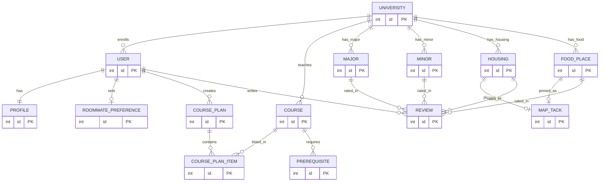

# ERD

```mermaid
erDiagram
  UNIVERSITY ||--o{ USER : enrolls
  UNIVERSITY ||--o{ COURSE : teaches
  UNIVERSITY ||--o{ MAJOR : has_major
  UNIVERSITY ||--o{ MINOR : has_minor
  UNIVERSITY ||--o{ HOUSING : has_housing
  UNIVERSITY ||--o{ FOOD_PLACE : has_food
  USER ||--|| PROFILE : has
  USER ||--o| ROOMMATE_PREFERENCE : sets
  USER ||--o{ COURSE_PLAN : creates
  USER ||--o{ REVIEW : writes
  COURSE_PLAN ||--o{ COURSE_PLAN_ITEM : contains
  COURSE ||--o{ COURSE_PLAN_ITEM : listed_in
  COURSE ||--o{ PREREQUISITE : requires
  HOUSING ||--o| MAP_TACK : pinned_as
  FOOD_PLACE ||--o| MAP_TACK : pinned_as
  HOUSING ||--o{ REVIEW : rated_in
  FOOD_PLACE ||--o{ REVIEW : rated_in
  MAJOR ||--o{ REVIEW : rated_in
  MINOR ||--o{ REVIEW : rated_in

  UNIVERSITY {
    int id PK
  }
  USER {
    int id PK
  }
  PROFILE {
    int id PK
  }
  ROOMMATE_PREFERENCE {
    int id PK
  }
  COURSE {
    int id PK
  }
  PREREQUISITE {
    int id PK
  }
  MAJOR {
    int id PK
  }
  MINOR {
    int id PK
  }
  COURSE_PLAN {
    int id PK
  }
  COURSE_PLAN_ITEM {
    int id PK
  }
  HOUSING {
    int id PK
  }
  FOOD_PLACE {
    int id PK
  }
  MAP_TACK {
    int id PK
  }
  REVIEW {
    int id PK
  }
```
