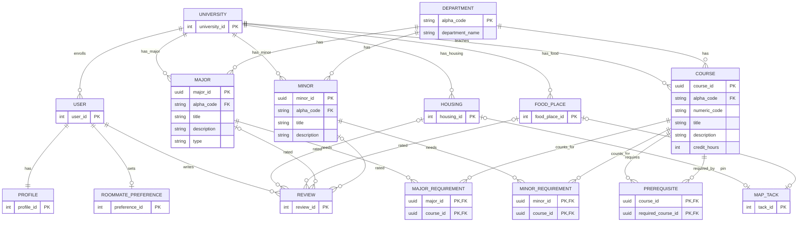

# ERD

```mermaid
erDiagram
  UNIVERSITY ||--o{ USER : enrolls
  UNIVERSITY ||--o{ COURSE : teaches
  UNIVERSITY ||--o{ MAJOR : has_major
  UNIVERSITY ||--o{ MINOR : has_minor
  UNIVERSITY ||--o{ HOUSING : has_housing
  UNIVERSITY ||--o{ FOOD_PLACE : has_food
  DEPARTMENT ||--o{ COURSE : has
  DEPARTMENT ||--o{ MAJOR : has
  DEPARTMENT ||--o{ MINOR : has
  MAJOR ||--o{ MAJOR_REQUIREMENT : needs
  COURSE ||--o{ MAJOR_REQUIREMENT : counts_for
  MINOR ||--o{ MINOR_REQUIREMENT : needs
  COURSE ||--o{ MINOR_REQUIREMENT : counts_for
  COURSE ||--o{ PREREQUISITE : requires
  COURSE ||--o{ PREREQUISITE : required_by
  USER ||--|| PROFILE : has
  USER ||--o| ROOMMATE_PREFERENCE : sets
  USER ||--o{ REVIEW : writes
  HOUSING |o--o| MAP_TACK : pin
  FOOD_PLACE |o--o| MAP_TACK : pin
  HOUSING |o--o{ REVIEW : rated
  FOOD_PLACE |o--o{ REVIEW : rated
  MAJOR |o--o{ REVIEW : rated
  MINOR |o--o{ REVIEW : rated

  UNIVERSITY {
    int university_id PK
  }
  USER {
    int user_id PK
  }
  PROFILE {
    int profile_id PK
  }
  ROOMMATE_PREFERENCE {
    int preference_id PK
  }
  DEPARTMENT {
    string alpha_code PK
    string department_name
  }
  COURSE {
    uuid course_id PK
    string alpha_code FK
    string numeric_code
    string title
    string description
    int credit_hours
  }
  MAJOR {
    uuid major_id PK
    string alpha_code FK
    string title
    string description
    string type
  }
  MINOR {
    uuid minor_id PK
    string alpha_code FK
    string title
    string description
  }
  MAJOR_REQUIREMENT {
    uuid major_id PK, FK
    uuid course_id PK, FK
  }
  MINOR_REQUIREMENT {
    uuid minor_id PK, FK
    uuid course_id PK, FK
  }
  PREREQUISITE {
    uuid course_id PK, FK
    uuid required_course_id PK, FK
  }
  HOUSING {
    int housing_id PK
  }
  FOOD_PLACE {
    int food_place_id PK
  }
  MAP_TACK {
    int tack_id PK
  }
  REVIEW {
    int review_id PK
  }
```
